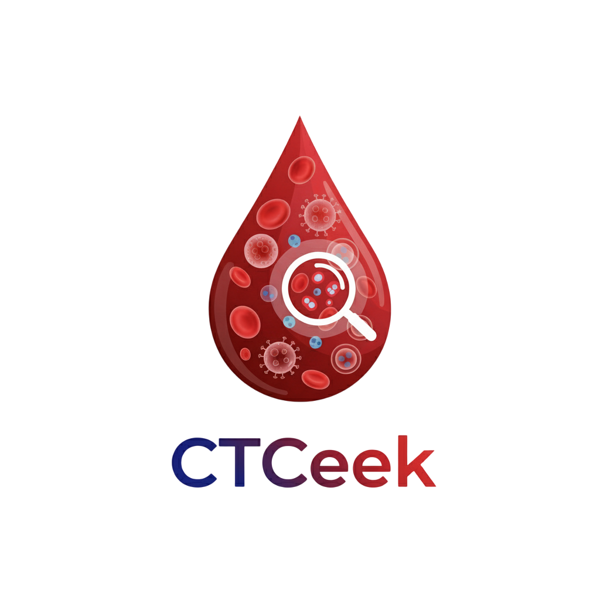
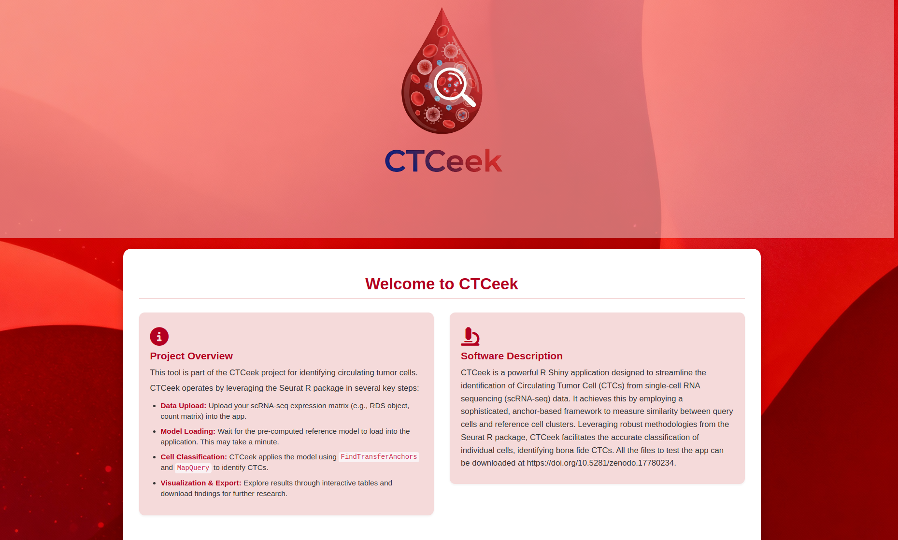
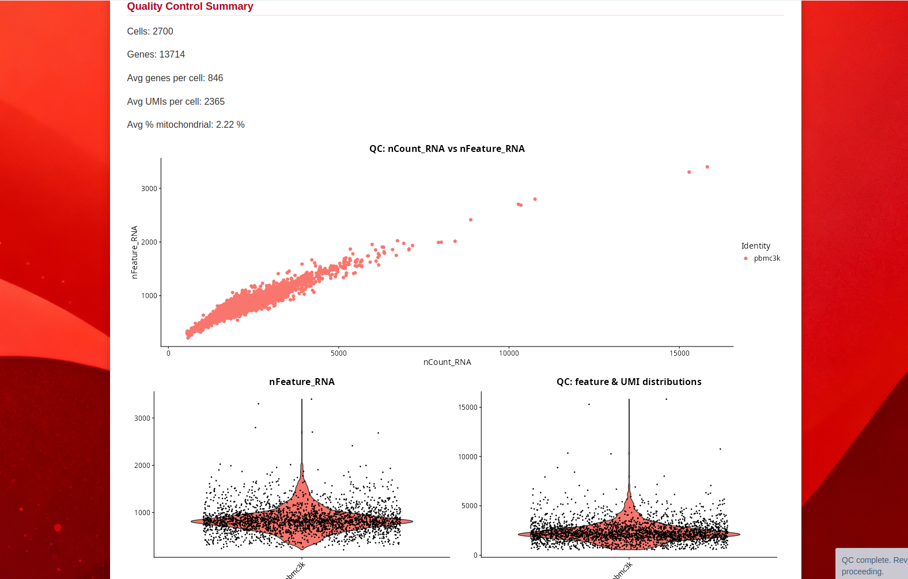
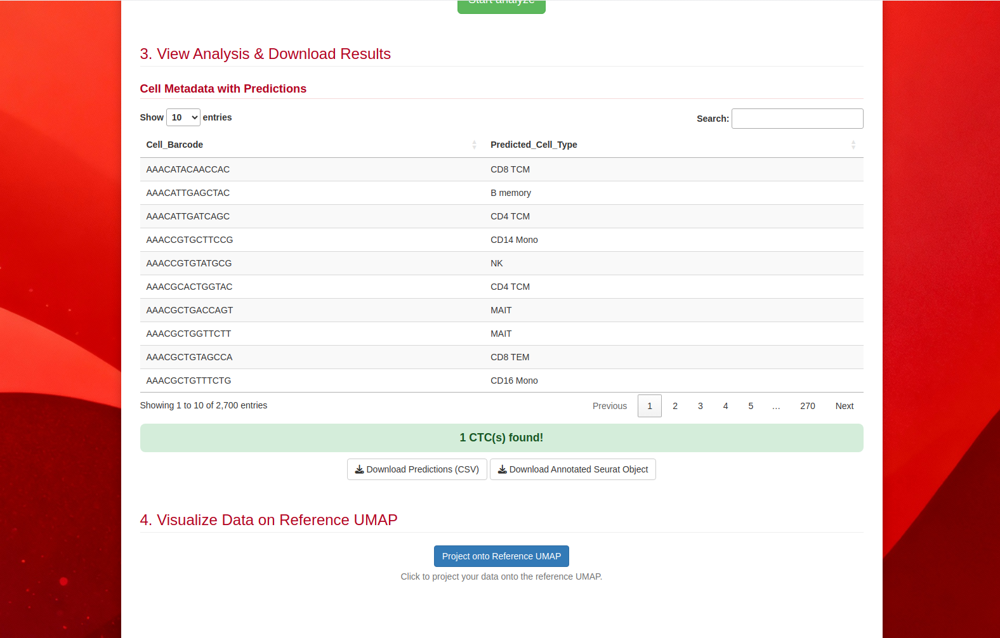
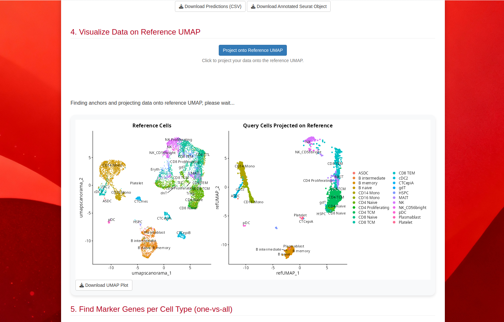

# CTCeek: Circulating Tumor Cell identification in scRNA-seq



## Table of Contents

* [About](#about)
* [Features](#features)
* [How It Works](#how-it-works)
* [Installation and Usage](#installation-and-usage)
* [Screenshots](#screenshots)
* [Contributing](#contributing)
* [License](#license)
* [Contact](#contact)
* [Acknowledgments](#acknowledgments)

---

## About

`CTCeek` is a powerful R Shiny application designed to streamline the identification of Circulating Tumor Cell (CTCs) from single-cell RNA sequencing (scRNA-seq) data. It achieves this by employing a sophisticated, anchor-based framework to measure similarity between query cells and reference cell clusters. Leveraging robust methodologies from the `Seurat` R package, `CTCeek` facilitates the accurate classification of individual cells, identifying bona fide CTCs.

This tool aims to simplify the complex process of CTC identification, providing an intuitive graphical user interface for researchers and clinicians to analyze their scRNA-seq datasets and gain critical insights into tumor metastasis and disease progression. Its ability to infer quantitative measurements and thresholds automatically, rather than relying on empirical selections, ensures well-generalized assignment performance on different single cell types.

## Features

* **Intuitive User Interface:** A user-friendly R Shiny interface for easy navigation and analysis.
* **Automated CTC Identification:** Efficient classification of single cells against a predefined reference, based on automatically inferred quantitative measurements and thresholds.
* **Data Input:** Supports scRNA-seq Seurat data format (.rds) for seamless integration.
* **Interactive Visualizations:** Provides interactive plots and tables to explore classification results and cell characteristics.
* **Downloadable Results:** Export processed data, cell classifications, and figures for further analysis.

## How It Works

`CTCeek` operates by leveraging the advanced functionalities of the `Seurat` R package in several key steps:

1.  **Data Upload:** Users upload their scRNA-seq expression matrix (e.g., Seurat object, count matrix) into the `CTCeek` Shiny app.

2.  **Model Loading:** The pre-computed reference model is loaded into the application.

3.  **Cell Classification:** `CTCeek` then applies the loaded reference model to classify each single cell in the uploaded dataset. This leverages the `FindTransferAnchors` and `MapQuery` functions to accurately identify Circulating Tumor Cells (CTCs) and distinguish them from PBMCs.

4.  **Results Visualization & Export:** The application then presents the classification results through interactive tables and plots, allowing users to explore the identified CTCs, examine their characteristics, and download the findings for further research.

## Installation and Usage
To run `CTCeek` you can access the website: AGGIUNGERE SITO WEB

To run `CTCeek` locally, you need R and RStudio installed.

1.  **Install R and RStudio:**
    * Download R from [CRAN](https://cran.r-project.org/).
    * Download RStudio Desktop from [Posit](https://posit.co/download/rstudio-desktop/).

2.  **Install R Packages:** Open RStudio and run the following commands in the R console to install the necessary packages:
    ```R
    # Install standard CRAN packages
    install.packages(c("shiny", "tidyverse", "Seurat", "ggplot2", "plotly", "DT", "shinyjs"))
    # Add any other specific CRAN R packages your app uses (e.g., patchwork, ggsci, etc.)

    # Install devtools if you don't have it (needed for install_github)
    if (!requireNamespace("devtools", quietly = TRUE)) {
        install.packages("devtools")
    }


    ```

3.  **Clone the Repository:**
    Open your terminal or Git Bash and clone this GitHub repository:
    ```bash
    git clone [https://github.com/PietroAnc/CTCeek.git](https://github.com/PietroAnc/CTCeek.git)
    ```
    Alternatively, in RStudio: `File > New Project... > Version Control > Git`, then paste the repository URL.

4. The benchmarking .rds files used to calculate statistics, as well as the reference dataset (to place into the www directory when running local) can be downloaded in our zenodo record (https://doi.org/10.5281/zenodo.17780234)
   File descripion:
   - pbmc3k.rds: PBMCs only data included in Seurat (2700 cells);
   - seurat_obj_BROAD_filtered.rds, PBMCs only data from The BROAD Institute Systematic Comparative Analysis dataset (where cells employed to build the reference .rds have been removed;
   - pbmcScactcSeurat.rds, our atlas dataset comprising CTCs, PBMCs, and non-CTC contaminants;
   - GSE255889andGSE295441.CTC.QC.136.rds, two datasets used as positive control which comprises 136 putative CTC profiles. The ground truth has been enstablished using CopyKAT and SCEVAN CNV tools (double positive = CTC).
     
## Screenshots



 The main application interface, showing data upload and initial options.


Example of the first QC results visualization, highlighting basic QC parameters and statistics.


Example of downloadable cell types prediction table of pbm3k negative control dataset.


UMAP plot of reference and CTC objects can be generated.


Markers can be calculated for the cell types of interest, using an one-vs-all approach.

## Contributing

We welcome contributions to `CTCeek`! If you have suggestions for improvements, bug reports, or would like to contribute code, please feel free to:

1.  Open an [issue](https://github.com/PietroAnc/CTCeek/issues) to discuss proposed changes or report bugs.
2.  Fork the repository and create a pull request with your contributions.

Please ensure your code adheres to standard R and Shiny best practices.

## License

This project is licensed under the GNU GENERAL PUBLIC LICENSE v3 - see the `LICENSE` file for details.

## Contact

For questions or further information, please contact:

* **Pietro Anc** - [pietro.ancona@unife.it]

## Acknowledgments

* This project was developed thanks to European Union PNRR grant obtained by Prof. Stefano Volinia
* Thanks to the R Shiny community for their resources and support.
